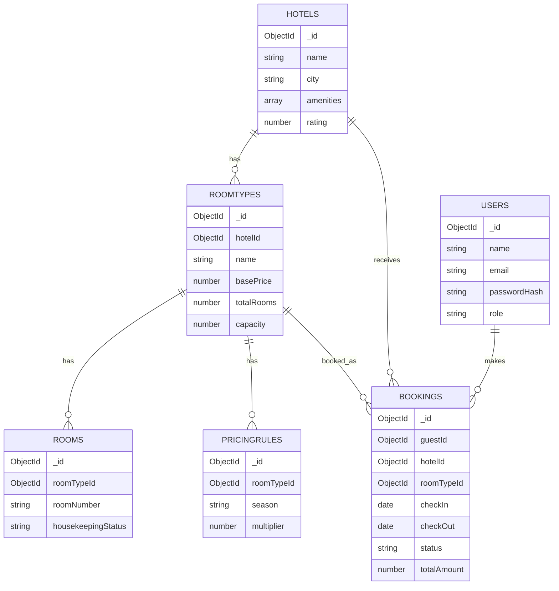
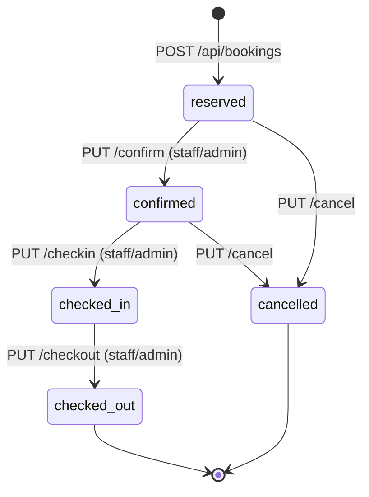

# Hotel Chain Reservation Backend

**CIA-3 Project — Advanced JavaScript Backend Frameworks (Node.js & Express.js)**
5th Semester · CHRIST (Deemed to be University)

## Team Details

| S.No | Student Name       | Roll No. | Department | Section  |
|------|--------------------|----------|-------------|---------|
| 1    | Sarah Stanley      | 2460446  |    CSE      | 5BTCS C |
| 2    | Sankara Narayanan S| 2460444  |    CSE      | 5BTCS C |
| 3    | Sarthak Sharma     | 2460487  |    CSE      | 5BTCS C |
| 4    | Tania Robby        | 2461032  |    CSE      | 5BTCS c |

**Project Code & Title:** — P03 - Hotel Chain Reservation Backend
**Course Name:** Advanced JavaScript Backend Frameworks (Node.js & Express.js)
**Section/Batch:** - Batch 45
**Semester:** 5th
**GitHub Repository:** _( )_

---

## 1. Problem Statement

A hotel chain with multiple properties needs a backend that lets guests search room availability across hotels, make date-based reservations without double-booking, and view their booking history — while hotel staff manage check-in/check-out and housekeeping, and admins manage properties, room inventory, and dynamic pricing. This project implements that backend as a REST API.

## 2. Objectives

- Model hotels, room types, and date-based availability in MongoDB
- Prevent double-booking through availability validation logic
- Support dynamic pricing per room type and season
- Provide staff-facing endpoints for check-in/check-out and housekeeping status
- Implement authentication and role separation for Guest, Staff, and Admin
- Produce a GitHub-hosted, README-documented codebase and Postman collection that a new developer can set up and run within minutes

## 3. Features

See the 13 modules table below — every listed module is fully implemented with real business logic (not CRUD stubs).

## 4. Technology Stack

| Layer | Choice |
|---|---|
| Backend | Node.js + Express.js |
| Database | MongoDB + Mongoose ODM |
| Authentication | JWT + bcrypt password hashing |
| Validation | express-validator |
| Testing/Docs | Postman collection (`postman/Hotel_Booking_Backend.postman_collection.json`) |

## 5. User Roles

| Role | Responsibility |
|---|---|
| **Guest** | Registers/logs in, searches availability, books/cancels own reservations, views own booking history and invoices |
| **Hotel Staff** | Manages room inventory (create/update rooms), performs check-in/check-out, updates housekeeping status, confirms/cancels bookings |
| **Admin** | Manages hotels, room types, pricing rules, views occupancy reports; can also perform all staff actions |

## 6. The 13 Functional Modules

| # | Module | Implemented As |
|---|---|---|
| 1 | Guest Registration & Authentication | `authController.js`, JWT + bcrypt, role self-elevation blocked |
| 2 | Hotel & Property Management | `hotelController.js` — full CRUD, admin-only writes |
| 3 | Room Type & Inventory Management | `roomTypeController.js`, `roomController.js` |
| 4 | Availability Search Engine | `availabilityController.js` — real date-overlap query against `bookings` |
| 5 | Reservation Booking Workflow | `bookingController.js::createBooking` — validates hotel/room-type relationship, capacity, availability, calculates price |
| 6 | Dynamic Pricing Rules | `pricingController.js` + `utils/pricing.js` |
| 7 | Booking Status Management | `bookingController.js` — explicit transition table |
| 8 | Check-in / Check-out Module | `checkInOutController.js` |
| 9 | Housekeeping Status Tracking | `housekeepingController.js` |
| 10 | Cancellation & Refund Policy Engine | `cancellationController.js` + `utils/refund.js` |
| 11 | Guest Booking History | `historyController.js` — ownership-protected |
| 12 | Invoice Generation Summary | `invoiceController.js` |
| 13 | Admin Occupancy Reports | `reportController.js` — live DB aggregation |

## 7. Database Collections & Relationships

  USERS
  -----
  _id, name, email, passwordHash, role
      |
      | (guestId) one user makes many bookings
      v
  BOOKINGS  --------------------------+
  -----                               |
  _id, guestId, hotelId, roomTypeId,  |
  checkIn, checkOut, status,          |
  totalAmount, cancellation{}         |
      ^                    ^          |
      | (hotelId)          | (roomTypeId)
      |                    |
  HOTELS               ROOMTYPES
  -----                 -----
  _id, name,            _id, hotelId, name,
  city, amenities[],    basePrice, totalRooms,
  rating                capacity
      |                    |   |
      | (hotelId)          |   | (roomTypeId)
      v                    |   v
  ROOMTYPES  <-------------+  ROOMS
  (one hotel has many         -----
   room types)                _id, roomTypeId,
                               roomNumber,
                               housekeepingStatus

  ROOMTYPES also has many PRICINGRULES:
  PRICINGRULES
  -----
  _id, roomTypeId, season, multiplier
  (one room type -> many pricing rules, one per season)

  Relationship key:
    one hotel         -> many room types
    one room type      -> many rooms
    one room type      -> many pricing rules
    one room type      -> many bookings
    one hotel          -> many bookings
    one user (guest)   -> many bookings

  All relationships use Mongoose references (ObjectId), not
  embedding -- see README section 7 for the reasoning.
**Reference vs. embed reasoning:** Every relationship above uses a Mongoose **reference** (ObjectId), not embedding. Hotels, room types, rooms, and bookings are each large, independently updated, and independently queried entities — e.g. housekeeping status on one room changes without touching its room type, and a booking's status changes many times through its lifecycle without touching the hotel or room type it references. None of these documents are "always read together and rarely updated independently," which is the rule of thumb for embedding, so referencing is the deliberate choice throughout. The one exception is `booking.cancellation`, which **is** embedded as a small sub-document because it is only ever read/written together with its parent booking.

To keep historical invoices accurate even if an admin changes a pricing rule later, `bookings` also stores a denormalized snapshot (`basePriceAtBooking`, `multiplierApplied`) at the time of booking.

### ER / Collection Diagram



## 8. Database Indexes

| Collection | Index | Reason |
|---|---|---|
| `users` | `{ email: 1 }` unique | Enforces uniqueness, speeds up login lookups |
| `hotels` | `{ name: 1 }`, `{ city: 1 }` | Speeds up search/listing |
| `roomTypes` | `{ hotelId: 1 }` | Speeds up "fetch by hotel" queries |
| `rooms` | `{ roomTypeId: 1 }`, `{ roomTypeId: 1, roomNumber: 1 }` unique | Speeds up "fetch by room type"; enforces unique room numbers per room type |
| `bookings` | `{ guestId: 1 }`, `{ roomTypeId: 1, checkIn: 1, checkOut: 1 }`, `{ hotelId: 1, status: 1 }` | Booking history lookups; the compound index is critical for the overlap query that runs on every availability search and booking |
| `pricingRules` | `{ roomTypeId: 1, season: 1 }` unique | One rule per season per room type; speeds up the price lookup on every booking |

## 9. Project Architecture

```  Postman / Browser Client
            |
            | HTTP request + JWT (Authorization: Bearer <token>)
            v
  +-----------------------------+
  |        Express.js App        |
  |   (server.js entry point)    |
  +-----------------------------+
            |
            v
  +-----------------------------+
  |         Middleware           |
  |  cors -> express.json ->     |
  |  authenticate -> authorize   |
  |  -> validate                 |
  +-----------------------------+
            |
            v
  +-----------------------------+
  |         Routes Layer         |
  |  authRoutes, hotelRoutes,    |
  |  bookingRoutes, etc.         |
  +-----------------------------+
            |
            v
  +-----------------------------+
  |   Controllers (Business      |
  |   Logic) - one per module    |
  +-----------------------------+
            |
            v
  +-----------------------------+
  |     Mongoose Models          |
  |  User, Hotel, RoomType,      |
  |  Room, Booking, PricingRule  |
  +-----------------------------+
            |
            v
  +-----------------------------+
  |          MongoDB             |
  +-----------------------------+

  On any failure at the Controller layer, control passes to a
  centralized Error Handler, which returns a consistent JSON
  error response to the client instead of crashing the server.
```

## 10. Folder Structure

```
hotel-booking-backend/
├── config/db.js
├── models/          User, Hotel, RoomType, Room, Booking, PricingRule
├── controllers/      one per module (13 modules across 12 files - checkInOut and
│                      cancellation reuse the booking transition helper)
├── routes/           authRoutes, hotelRoutes, roomTypeRoutes, roomRoutes,
│                      availabilityRoutes, bookingRoutes, pricingRoutes,
│                      historyRoutes, reportRoutes
├── middleware/       auth.js, validate.js, errorHandler.js
├── frontend/         hotel-booking-frontend.html, index.html (interactive demo client)
├── utils/            generateToken.js, pricing.js, refund.js, seed.js
├── postman/          Hotel_Booking_Backend.postman_collection.json
├── .env.example
├── .gitignore
├── package.json
├── server.js
└── README.md
```

**Note on structure:** routes are grouped by resource (per the project specification's suggested structure) rather than one file per module — e.g. check-in/check-out, cancellation, and invoice endpoints live under `bookingRoutes.js` since they all operate on the `Booking` resource, and housekeeping lives under `roomRoutes.js` since it operates on `Room`. This avoids duplicate route registration while still implementing every required endpoint.

## 11. Installation

```bash
git clone <your-repo-url>
cd hotel-booking-backend
npm install
```

## 12. Environment Setup

Copy `.env.example` to `.env` and fill in real values:

```bash
cp .env.example .env
```

```
PORT=5000
MONGO_URI=mongodb+srv://<username>:<password>@<cluster_name>.mongodb.net/hotel-booking-backend
JWT_SECRET=replace_this_with_a_long_random_secret
JWT_EXPIRES_IN=7d
```

Never commit `.env` — it is already listed in `.gitignore`.

## 13. Running the Project

```bash
npm run dev      # nodemon, auto-restarts on file changes
# or
npm start        # plain node
```

Upon startup, the terminal outputs clickable URLs:
```text
Server running on port 5000
> Frontend: http://localhost:5000
> Health:   http://localhost:5000/api/health
MongoDB connected: ...
```

### Accessing the Web Frontend
Open **[http://localhost:5000](http://localhost:5000)** (or `http://localhost:5000/app`) in any browser. The built-in client provides:
- Live backend connection status badge (`🟢 Backend Connected` / `🔴 Backend Offline`)
- "Test Connection" button for on-demand health verification
- Guest registration and sign-in
- Real-time room availability search across hotels and dates
- One-click booking with dynamic pricing breakdown
- "My Bookings" dashboard with cancellation & invoice view

Optionally seed demo data (admin/staff/guest accounts, a hotel, room type, rooms, pricing rules):

```bash
npm run seed
```

Seeded logins:
- Admin: `admin@hotelchain.com` / `Admin@123`
- Staff: `staff@hotelchain.com` / `Staff@123`
- Guest: `guest@hotelchain.com` / `Guest@123`

## 14. API Endpoints

| Method | Endpoint | Auth | Description |
|---|---|---|---|
| GET | `/` | — | Serves Frontend UI (browsers) or API status (JSON) |
| GET | `/app` | — | Dedicated frontend client route |
| GET | `/api/health` | — | Health check & backend connectivity status |
| POST | `/api/auth/register` | — | Guest registration |
| POST | `/api/auth/login` | — | Login (any role) |
| POST | `/api/auth/staff-register` | admin | Create a staff/admin account |
| POST | `/api/hotels` | admin | Create hotel |
| GET | `/api/hotels` | — | List hotels (`?city=`) |
| GET | `/api/hotels/:id` | — | Get one hotel |
| PUT | `/api/hotels/:id` | admin | Update hotel |
| DELETE | `/api/hotels/:id` | admin | Delete hotel (blocked if it has room types) |
| GET | `/api/hotels/search` | — | **Availability search** `?city=&hotelId=&checkIn=&checkOut=&guests=` |
| POST | `/api/room-types` | admin | Create room type |
| GET | `/api/room-types` | — | List room types (`?hotelId=`) |
| GET | `/api/room-types/:id` | — | Get one room type |
| PUT | `/api/room-types/:id` | admin | Update room type |
| DELETE | `/api/room-types/:id` | admin | Delete room type (blocked if it has rooms) |
| POST | `/api/rooms` | admin/staff | Create room |
| GET | `/api/rooms` | — | List rooms (`?roomTypeId=`, `?housekeepingStatus=`) |
| GET | `/api/rooms/:id` | — | Get one room |
| PUT | `/api/rooms/:id` | admin/staff | Update room |
| PUT | `/api/rooms/:id/housekeeping` | admin/staff | Update housekeeping status |
| POST | `/api/pricing-rules` | admin | Create pricing rule |
| GET | `/api/pricing-rules` | auth | List pricing rules (`?roomTypeId=`) |
| PUT | `/api/pricing-rules/:id` | admin | Update pricing rule |
| DELETE | `/api/pricing-rules/:id` | admin | Delete pricing rule |
| POST | `/api/bookings` | guest | **Create a reservation** |
| GET | `/api/bookings` | staff/admin | List all bookings (`?status=`, `?hotelId=`) |
| GET | `/api/bookings/:id` | owner/staff/admin | Get one booking |
| PUT | `/api/bookings/:id/confirm` | staff/admin | reserved → confirmed |
| PUT | `/api/bookings/:id/checkin` | staff/admin | confirmed → checked-in |
| PUT | `/api/bookings/:id/checkout` | staff/admin | checked-in → checked-out |
| PUT | `/api/bookings/:id/cancel` | owner/staff/admin | Cancel + calculate refund |
| GET | `/api/bookings/:id/invoice` | owner/staff/admin | Invoice summary |
| GET | `/api/guests/:id/bookings` | owner/staff/admin | Guest booking history |
| GET | `/api/admin/reports/occupancy` | admin | Occupancy & revenue report |

## 15. Authentication

Self-built JWT flow. `POST /api/auth/register` and `/login` return a signed JWT (`{ id, role }` payload) valid for `JWT_EXPIRES_IN`. Protected routes require `Authorization: Bearer <token>`. Invalid or expired tokens return `401` with `errorCode: INVALID_TOKEN` / `TOKEN_EXPIRED`.

## 16. Authorization

Role-based, enforced by `middleware/auth.js::authorize(...roles)`. Ownership is additionally checked in controllers for guest-owned resources (bookings, booking history, invoices) so a guest cannot access another guest's data by changing an ID in the URL — even with a valid token.

## 17. Validation

All request bodies/params are validated via `express-validator` chains declared in the routes layer, run through the shared `middleware/validate.js` before any controller executes. Invalid requests return a consistent `400` with per-field messages.

## 18. Error Handling

`middleware/errorHandler.js` centralizes all error responses. Controllers either call `next(new AppError(message, statusCode, errorCode))` for business-rule errors or simply `next(err)` for unexpected ones; the handler also maps Mongoose `CastError` → 404, duplicate key `11000` → 409, and `ValidationError` → 400. The server never crashes on a bad request — every path resolves to a JSON error response.

Consistent response shape:
```json
{ "success": false, "message": "...", "errorCode": "..." }
```

## 19. Booking Workflow



Transitions not shown above (e.g. `checked-out → reserved`, `cancelled → confirmed`) are rejected with `409 INVALID_STATUS_TRANSITION`.

## 20. Dynamic Pricing Logic

Documented in full in `utils/pricing.js`. Summary: the stay is split into individual nights; each night is auto-classified as `weekend` (Friday/Saturday) or `standard` (any other night), unless the booking request supplies an explicit `season` override (`peak`/`off-peak`/etc., useful for holiday periods). The matching `PricingRule` multiplier for `(roomTypeId, season)` is applied to `basePrice` per night; nights are summed for the total. If no rule exists for a season, a neutral `1.0` multiplier is used so a missing rule never blocks a booking. All multiplier values live in the `pricingRules` collection — nothing is hardcoded.

## 21. Cancellation / Refund Policy

Documented in full in `utils/refund.js`:

| Cancelled | Refund |
|---|---|
| 48+ hours before check-in | 100% (full) |
| 24–48 hours before check-in | 50% (partial) |
| Less than 24 hours before check-in | 0% (none) |

Only bookings in `reserved` or `confirmed` status can be cancelled — a `checked-in`/`checked-out` booking is not (mirrors the booking status transition table).

## 22. Occupancy Report Logic

`GET /api/admin/reports/occupancy` computes, per hotel and overall, from live data: total rooms (sum of `roomType.totalRooms`), currently-booked rooms (active bookings whose date range spans "now"), available rooms, occupancy percentage, and total revenue (sum of `totalAmount` across confirmed/checked-in/checked-out bookings). Nothing is hardcoded.

## 23. Postman Testing Instructions

1. Import `postman/Hotel_Booking_Backend.postman_collection.json` into Postman.
2. Set the collection variable `baseUrl` (defaults to `http://localhost:5000`).
3. Run **1. Auth → Register Guest / Login Admin (seeded) / Login Staff (seeded)** first — their test scripts auto-populate `guestToken`, `adminToken`, `staffToken`, and `guestId` collection variables used by every later request.
4. Run folders top to bottom: Hotels → Room Types & Rooms → Pricing Rules → Availability Search → Bookings → Cancellation → Guest Booking History → Admin Reports.
5. Each folder includes the required scenario coverage:
   - **Happy path** (valid request succeeds)
   - **Validation failure** → 400
   - **Missing/invalid JWT** → 401
   - **Wrong role** → 403
   - **Business conflict** (double booking, invalid status transition) → 409
   - **Not found** (bad ID) → 404
   - **\*\*Ownership restriction\*\*** (guest attempts to access another guest's booking history) → 403

## 24. Sample Request/Response

**POST `/api/bookings`**
```json
{
  "hotelId": "<hotelId>",
  "roomTypeId": "<roomTypeId>",
  "checkIn": "2026-10-10",
  "checkOut": "2026-10-12",
  "guests": 2
}
```
**201 Response**
```json
{
  "success": true,
  "message": "Booking created successfully",
  "data": {
    "booking": { "_id": "...", "status": "reserved", "totalAmount": 10125, "...": "..." },
    "priceBreakdown": [
      { "date": "2026-10-10", "season": "weekend", "multiplier": 1.25, "rate": 5625 },
      { "date": "2026-10-11", "season": "standard", "multiplier": 1, "rate": 4500 }
    ]
  }
}
```

## 25. GitHub Usage

```bash
git init
git add .
git commit -m "Initial project setup"
git branch -M main
git remote add origin <GITHUB_URL>
git push -u origin main
```

Suggested commit sequence for a 3–4 person team (so history reflects everyone's contribution, not one account):
1. `chore: project scaffold, package.json, .env.example, .gitignore` (Member 4 / whoever owns setup)
2. `feat: auth module - registration, login, JWT, bcrypt` (Member 1)
3. `feat: hotel & room type & room inventory modules` (Member 1)
4. `feat: availability search engine` (Member 1)
5. `feat: booking workflow, status transitions, check-in/out` (Member 2)
6. `feat: dynamic pricing rules` (Member 2)
7. `feat: housekeeping, cancellation & refund engine` (Member 3)
8. `feat: booking history, invoice, occupancy reports` (Member 3)
9. `docs: README, Postman collection, diagrams` (Member 4)
10. `chore: final review, error handling polish` (all)

## 26. Team Member Section

_(Add a one-line description of what each member built, matching the commit history above.)_

## 27. Known Limitations / Challenges

- Single currency and single time zone assumed throughout (per spec's stated boundaries).
- Payment gateway is not integrated — refunds are calculated and stored, not actually transferred (mocked, per spec).
- Dynamic pricing auto-classifies weekend vs. standard by day-of-week; true calendar-based "peak season" date ranges (e.g. Dec 20–Jan 5) are supported via the optional `season` override on a booking but are not auto-detected from a date-range table, to keep the schema and logic simple and explainable for a CIA-3 submission.

## 28. Future Enhancements

- A `seasonCalendar` collection mapping date ranges to seasons, so `peak`/`off-peak` can be auto-detected like `weekend` is.
- Multi-currency support.
- Real payment gateway integration for refunds.
- Room-level (not just room-type-level) assignment at booking time.

## 29. Deliverables Checklist

- [x] Complete Node.js + Express.js + MongoDB source code
- [x] README.md with setup instructions and API endpoint list
- [x] Postman collection covering all implemented endpoints
- [x] GitHub repository created and pushed _(you do this)_
- [x] PPT presentation _(see PPT_CONTENT.md)_
- [x] PDF report _(see PDF_CONTENT.md)_
- [x] Team Details page completed _(fill in table above)_

## 30. Grading Alignment

Built to satisfy every item in the CIA-3 rubric (functional modules, DB design, code quality, error handling, GitHub hygiene, PPT content, viva readiness) — see `PPT_CONTENT.md` and `PDF_CONTENT.md` for presentation/report structure.
